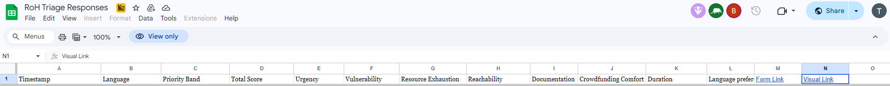
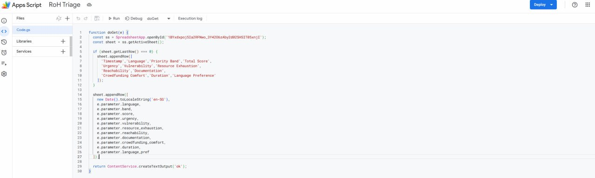
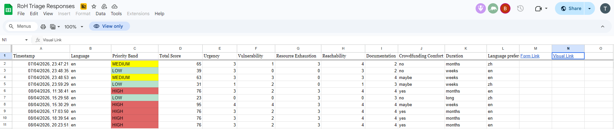

# RoH Case Triage Tool

## 📌 Overview

This is a lightweight, self-contained web application designed to triage incoming assistance requests based on urgency and need. It calculates a priority score in real time and submits responses to a Google Sheet via Google Apps Script.

The system is intentionally simple:

* **Frontend only** (HTML, CSS, JavaScript)
* **No traditional backend**
* **Google Sheets = database**
* **Google Apps Script = API endpoint**

---

## 🧱 How It Works

1. User fills in the form
2. JavaScript calculates a **priority score (0–100)** using weighted factors
3. User submits the form
4. Data is sent to a **Google Apps Script Web App**
5. Apps Script writes the data into a **Google Sheet**

```
[User Form]
     ↓
[Browser JS scoring]
     ↓
[Fetch request]
     ↓
[Google Apps Script]
     ↓
[Google Sheet]
```

## ⚙️ Setup Instructions (Google Apps Script)

### Step 1: Create a Google Sheet

1. Go to Google Sheets
2. Create a new spreadsheet
3. Name it (e.g. `RoH Triage Responses`)
4. Create headers in Row 1 (example):

```
Timestamp | Language | Band | Score | Urgency | Vulnerability | Resource Exhaustion | Reachability | Documentation | Crowdfunding Comfort | Duration | Language Pref
```

---

### Step 2: Create Apps Script

1. Go to https://script.google.com/
2. Create new Project
3. Paste the following:

```javascript
function doGet(e) {
  const ss = SpreadsheetApp.openById('YOUR_SHEETS_ID_HERE');
  const sheet = ss.getActiveSheet();

  if (sheet.getLastRow() === 0) {
    sheet.appendRow([
      'Timestamp','Language','Priority Band','Total Score',
      'Urgency','Vulnerability','Resource Exhaustion',
      'Reachability','Documentation',
      'Crowdfunding Comfort','Duration','Language Preference'
    ]);
  }

  sheet.appendRow([
    new Date().toLocaleString('en-SG'),
    e.parameter.language,
    e.parameter.band,
    e.parameter.score,
    e.parameter.urgency,
    e.parameter.vulnerability,
    e.parameter.resource_exhaustion,
    e.parameter.reachability,
    e.parameter.documentation,
    e.parameter.crowdfunding_comfort,
    e.parameter.duration,
    e.parameter.language_pref
  ]);

  return ContentService.createTextOutput('ok');
}
```

> ⚠️ Make sure `"YOUR_SHEETS_ID_HERE"` matches your actual sheet id, it is found in your sheets URL `https://docs.google.com/spreadsheets/d/YOUR_SHEETS_ID_HERE`


---

### Step 3: Deploy as Web App

1. Click **Deploy → Manage deployments**
2. Click **New deployment**
3. Select **Web app**
4. Configure:

   * **Execute as:** Me
   * **Who has access:** Anyone
5. Click **Deploy**
6. Copy the **Web App URL**

It will look like:

```
https://script.google.com/macros/s/XXXXXXXX/exec
```

---

### Step 4: Connect to Frontend

In your HTML file, replace:

```js
const SHEETS_URL = 'YOUR_SCRIPT_URL_HERE';
```

With your deployed URL.

---

### Step 5: Test

1. Open the HTML file in browser
2. Fill out the form
3. Submit
4. Check your Google Sheet → a new row should appear


---

## 🧪 Modes

This app supports two modes:

### 🧑‍💼 Staff Mode (default)

* Shows scoring dashboard
* Shows weights and factor breakdown
* Enables config editor

### 🧑‍🤝‍🧑 Form Mode

Add this to the URL:

```
?mode=form
```

* Hides scoring details
* Shows progress bar
* Shows submit button
* Cleaner UX for beneficiaries

---

## ✏️ Admin Editor

Built-in configuration editor allows you to:

* Adjust **factor weights**
* Edit **questions and options**
* Modify **score thresholds**
* Download updated HTML

Access via:

```
⚙ Edit Config button (top of page)
```

---
